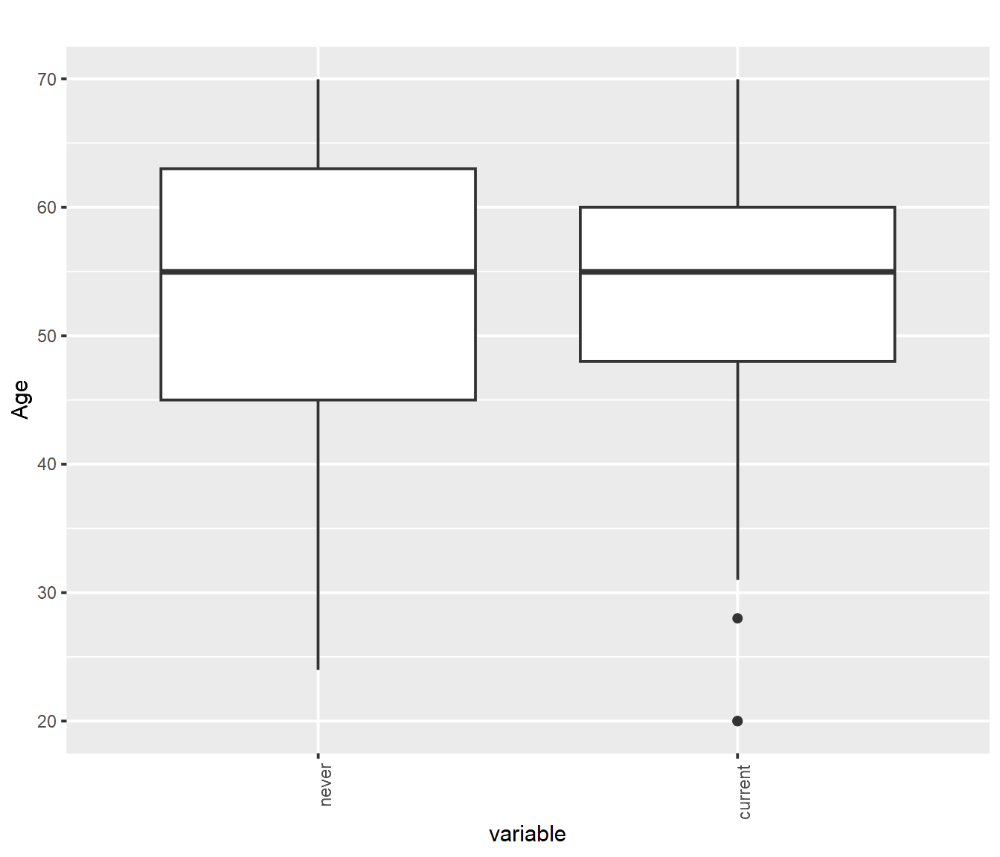

# EWAS report
- study: Illumina methylation data
- author: Analyst
- date: 05 septiembre, 2023

## Parameters


```
## $sig.threshold
## [1] 0.000386
## 
## $max.plots
## [1] 1
## 
## $model
## [1] "sva"
## 
## $qq.inflation.method
## [1] "median"
## 
## $practical.threshold
##   cg21566642 
## 8.297569e-26 
## 
## $winsorize.pct
## [1] 0.05
## 
## $outlier.iqr.factor
## [1] NA
## 
## $rlm
## [1] TRUE
## 
## $most.variable
## [1] 50000
## 
## $random.seed
## [1] 20161123
## 
## $sample.size
## [1] 188
```

## Sample characteristics

For continuous or ordinal variables, the "mean" column provides the mean
and the "var" column the standard deviation of the variable.
For categorical variables, the "mean" column provides the number
of samples with the given "value" and the
"var" column the percentage of samples with the given "value".

<table>
 <thead>
  <tr>
   <th style="text-align:left;"> variable </th>
   <th style="text-align:left;"> value </th>
   <th style="text-align:left;"> mean </th>
   <th style="text-align:left;"> var </th>
  </tr>
 </thead>
<tbody>
  <tr>
   <td style="text-align:left;"> variable of interest </td>
   <td style="text-align:left;"> never </td>
   <td style="text-align:left;"> 99 </td>
   <td style="text-align:left;"> 52.7 </td>
  </tr>
  <tr>
   <td style="text-align:left;"> variable of interest </td>
   <td style="text-align:left;"> current </td>
   <td style="text-align:left;"> 89 </td>
   <td style="text-align:left;"> 47.3 </td>
  </tr>
  <tr>
   <td style="text-align:left;"> Age </td>
   <td style="text-align:left;">  </td>
   <td style="text-align:left;"> 52.73936 </td>
   <td style="text-align:left;"> 11.63027 </td>
  </tr>
  <tr>
   <td style="text-align:left;"> Sex </td>
   <td style="text-align:left;"> F </td>
   <td style="text-align:left;"> 144 </td>
   <td style="text-align:left;"> 76.6 </td>
  </tr>
  <tr>
   <td style="text-align:left;"> Sex </td>
   <td style="text-align:left;"> M </td>
   <td style="text-align:left;"> 44 </td>
   <td style="text-align:left;"> 23.4 </td>
  </tr>
  <tr>
   <td style="text-align:left;"> Bcell </td>
   <td style="text-align:left;">  </td>
   <td style="text-align:left;"> 0.06601765 </td>
   <td style="text-align:left;"> 0.02948774 </td>
  </tr>
  <tr>
   <td style="text-align:left;"> CD4T </td>
   <td style="text-align:left;">  </td>
   <td style="text-align:left;"> 0.188321 </td>
   <td style="text-align:left;"> 0.06010949 </td>
  </tr>
  <tr>
   <td style="text-align:left;"> CD8T </td>
   <td style="text-align:left;">  </td>
   <td style="text-align:left;"> 0.1090449 </td>
   <td style="text-align:left;"> 0.04596973 </td>
  </tr>
  <tr>
   <td style="text-align:left;"> Mono </td>
   <td style="text-align:left;">  </td>
   <td style="text-align:left;"> 0.09398571 </td>
   <td style="text-align:left;"> 0.02091805 </td>
  </tr>
  <tr>
   <td style="text-align:left;"> Neu </td>
   <td style="text-align:left;">  </td>
   <td style="text-align:left;"> 0.5042772 </td>
   <td style="text-align:left;"> 0.0978032 </td>
  </tr>
  <tr>
   <td style="text-align:left;"> NK </td>
   <td style="text-align:left;">  </td>
   <td style="text-align:left;"> 0.08488758 </td>
   <td style="text-align:left;"> 0.03298624 </td>
  </tr>
</tbody>
</table>

## Covariate associations


### Covariate Age


statistics
<table>
 <thead>
  <tr>
   <th style="text-align:left;"> var1 </th>
   <th style="text-align:left;"> var2 </th>
   <th style="text-align:right;"> F </th>
   <th style="text-align:right;"> p-value </th>
   <th style="text-align:right;"> R </th>
   <th style="text-align:right;"> p-value </th>
  </tr>
 </thead>
<tbody>
  <tr>
   <td style="text-align:left;"> variable </td>
   <td style="text-align:left;"> Age </td>
   <td style="text-align:right;"> 0.0001012 </td>
   <td style="text-align:right;"> 0.9919836 </td>
   <td style="text-align:right;"> -0.0271044 </td>
   <td style="text-align:right;"> 0.7119591 </td>
  </tr>
</tbody>
</table>

cases
<table>
 <thead>
  <tr>
   <th style="text-align:left;"> variable </th>
   <th style="text-align:right;"> mean </th>
   <th style="text-align:right;"> var </th>
   <th style="text-align:right;"> n </th>
   <th style="text-align:right;"> t.stat </th>
   <th style="text-align:right;"> p.value </th>
  </tr>
 </thead>
<tbody>
  <tr>
   <td style="text-align:left;"> never </td>
   <td style="text-align:right;"> 52.74747 </td>
   <td style="text-align:right;"> 156.7621 </td>
   <td style="text-align:right;"> 99 </td>
   <td style="text-align:right;"> 0.0101488 </td>
   <td style="text-align:right;"> 0.9919135 </td>
  </tr>
  <tr>
   <td style="text-align:left;"> current </td>
   <td style="text-align:right;"> 52.73034 </td>
   <td style="text-align:right;"> 112.8583 </td>
   <td style="text-align:right;"> 89 </td>
   <td style="text-align:right;"> -0.0101488 </td>
   <td style="text-align:right;"> 0.9919135 </td>
  </tr>
</tbody>
</table>





### Covariate Sex


statistics
<table>
 <thead>
  <tr>
   <th style="text-align:left;"> var1 </th>
   <th style="text-align:left;"> var2 </th>
   <th style="text-align:right;"> R </th>
   <th style="text-align:right;"> p-value </th>
  </tr>
 </thead>
<tbody>
  <tr>
   <td style="text-align:left;"> variable </td>
   <td style="text-align:left;"> Sex </td>
   <td style="text-align:right;"> 0.054606 </td>
   <td style="text-align:right;"> 0.4567064 </td>
  </tr>
</tbody>
</table>

frequencies
<table>
 <thead>
  <tr>
   <th style="text-align:left;">   </th>
   <th style="text-align:right;"> F </th>
   <th style="text-align:right;"> M </th>
  </tr>
 </thead>
<tbody>
  <tr>
   <td style="text-align:left;"> never </td>
   <td style="text-align:right;"> 78 </td>
   <td style="text-align:right;"> 21 </td>
  </tr>
  <tr>
   <td style="text-align:left;"> current </td>
   <td style="text-align:right;"> 66 </td>
   <td style="text-align:right;"> 23 </td>
  </tr>
</tbody>
</table>

enrichment p-values
<table>
 <thead>
  <tr>
   <th style="text-align:left;">   </th>
   <th style="text-align:right;"> F </th>
   <th style="text-align:right;"> M </th>
  </tr>
 </thead>
<tbody>
  <tr>
   <td style="text-align:left;"> never </td>
   <td style="text-align:right;"> 0.2820187 </td>
   <td style="text-align:right;"> 0.8215467 </td>
  </tr>
  <tr>
   <td style="text-align:left;"> current </td>
   <td style="text-align:right;"> 0.8215467 </td>
   <td style="text-align:right;"> 0.2820187 </td>
  </tr>
</tbody>
</table>


### Covariate Bcell


statistics
<table>
 <thead>
  <tr>
   <th style="text-align:left;"> var1 </th>
   <th style="text-align:left;"> var2 </th>
   <th style="text-align:right;"> F </th>
   <th style="text-align:right;"> p-value </th>
   <th style="text-align:right;"> R </th>
   <th style="text-align:right;"> p-value </th>
  </tr>
 </thead>
<tbody>
  <tr>
   <td style="text-align:left;"> variable </td>
   <td style="text-align:left;"> Bcell </td>
   <td style="text-align:right;"> 0.2366181 </td>
   <td style="text-align:right;"> 0.6272321 </td>
   <td style="text-align:right;"> -0.1165057 </td>
   <td style="text-align:right;"> 0.1113357 </td>
  </tr>
</tbody>
</table>

cases
<table>
 <thead>
  <tr>
   <th style="text-align:left;"> variable </th>
   <th style="text-align:right;"> mean </th>
   <th style="text-align:right;"> var </th>
   <th style="text-align:right;"> n </th>
   <th style="text-align:right;"> t.stat </th>
   <th style="text-align:right;"> p.value </th>
  </tr>
 </thead>
<tbody>
  <tr>
   <td style="text-align:left;"> never </td>
   <td style="text-align:right;"> 0.0670116 </td>
   <td style="text-align:right;"> 0.0004847 </td>
   <td style="text-align:right;"> 99 </td>
   <td style="text-align:right;"> 0.4746479 </td>
   <td style="text-align:right;"> 0.6357655 </td>
  </tr>
  <tr>
   <td style="text-align:left;"> current </td>
   <td style="text-align:right;"> 0.0649121 </td>
   <td style="text-align:right;"> 0.0013056 </td>
   <td style="text-align:right;"> 89 </td>
   <td style="text-align:right;"> -0.4746479 </td>
   <td style="text-align:right;"> 0.6357655 </td>
  </tr>
</tbody>
</table>


### Covariate CD4T


statistics
<table>
 <thead>
  <tr>
   <th style="text-align:left;"> var1 </th>
   <th style="text-align:left;"> var2 </th>
   <th style="text-align:right;"> F </th>
   <th style="text-align:right;"> p-value </th>
   <th style="text-align:right;"> R </th>
   <th style="text-align:right;"> p-value </th>
  </tr>
 </thead>
<tbody>
  <tr>
   <td style="text-align:left;"> variable </td>
   <td style="text-align:left;"> CD4T </td>
   <td style="text-align:right;"> 1.708011 </td>
   <td style="text-align:right;"> 0.1928572 </td>
   <td style="text-align:right;"> 0.0797971 </td>
   <td style="text-align:right;"> 0.2763471 </td>
  </tr>
</tbody>
</table>

cases
<table>
 <thead>
  <tr>
   <th style="text-align:left;"> variable </th>
   <th style="text-align:right;"> mean </th>
   <th style="text-align:right;"> var </th>
   <th style="text-align:right;"> n </th>
   <th style="text-align:right;"> t.stat </th>
   <th style="text-align:right;"> p.value </th>
  </tr>
 </thead>
<tbody>
  <tr>
   <td style="text-align:left;"> never </td>
   <td style="text-align:right;"> 0.1828989 </td>
   <td style="text-align:right;"> 0.0033585 </td>
   <td style="text-align:right;"> 99 </td>
   <td style="text-align:right;"> -1.301991 </td>
   <td style="text-align:right;"> 0.1945799 </td>
  </tr>
  <tr>
   <td style="text-align:left;"> current </td>
   <td style="text-align:right;"> 0.1943523 </td>
   <td style="text-align:right;"> 0.0038679 </td>
   <td style="text-align:right;"> 89 </td>
   <td style="text-align:right;"> 1.301991 </td>
   <td style="text-align:right;"> 0.1945799 </td>
  </tr>
</tbody>
</table>


### Covariate CD8T


statistics
<table>
 <thead>
  <tr>
   <th style="text-align:left;"> var1 </th>
   <th style="text-align:left;"> var2 </th>
   <th style="text-align:right;"> F </th>
   <th style="text-align:right;"> p-value </th>
   <th style="text-align:right;"> R </th>
   <th style="text-align:right;"> p-value </th>
  </tr>
 </thead>
<tbody>
  <tr>
   <td style="text-align:left;"> variable </td>
   <td style="text-align:left;"> CD8T </td>
   <td style="text-align:right;"> 3.076023 </td>
   <td style="text-align:right;"> 0.0811016 </td>
   <td style="text-align:right;"> -0.1161131 </td>
   <td style="text-align:right;"> 0.1125543 </td>
  </tr>
</tbody>
</table>

cases
<table>
 <thead>
  <tr>
   <th style="text-align:left;"> variable </th>
   <th style="text-align:right;"> mean </th>
   <th style="text-align:right;"> var </th>
   <th style="text-align:right;"> n </th>
   <th style="text-align:right;"> t.stat </th>
   <th style="text-align:right;"> p.value </th>
  </tr>
 </thead>
<tbody>
  <tr>
   <td style="text-align:left;"> never </td>
   <td style="text-align:right;"> 0.1145895 </td>
   <td style="text-align:right;"> 0.0023595 </td>
   <td style="text-align:right;"> 99 </td>
   <td style="text-align:right;"> 1.766782 </td>
   <td style="text-align:right;"> 0.0789065 </td>
  </tr>
  <tr>
   <td style="text-align:left;"> current </td>
   <td style="text-align:right;"> 0.1028774 </td>
   <td style="text-align:right;"> 0.0017899 </td>
   <td style="text-align:right;"> 89 </td>
   <td style="text-align:right;"> -1.766782 </td>
   <td style="text-align:right;"> 0.0789065 </td>
  </tr>
</tbody>
</table>


### Covariate Mono


statistics
<table>
 <thead>
  <tr>
   <th style="text-align:left;"> var1 </th>
   <th style="text-align:left;"> var2 </th>
   <th style="text-align:right;"> F </th>
   <th style="text-align:right;"> p-value </th>
   <th style="text-align:right;"> R </th>
   <th style="text-align:right;"> p-value </th>
  </tr>
 </thead>
<tbody>
  <tr>
   <td style="text-align:left;"> variable </td>
   <td style="text-align:left;"> Mono </td>
   <td style="text-align:right;"> 6.977278 </td>
   <td style="text-align:right;"> 0.0089576 </td>
   <td style="text-align:right;"> -0.1655813 </td>
   <td style="text-align:right;"> 0.0231534 </td>
  </tr>
</tbody>
</table>

cases
<table>
 <thead>
  <tr>
   <th style="text-align:left;"> variable </th>
   <th style="text-align:right;"> mean </th>
   <th style="text-align:right;"> var </th>
   <th style="text-align:right;"> n </th>
   <th style="text-align:right;"> t.stat </th>
   <th style="text-align:right;"> p.value </th>
  </tr>
 </thead>
<tbody>
  <tr>
   <td style="text-align:left;"> never </td>
   <td style="text-align:right;"> 0.0977469 </td>
   <td style="text-align:right;"> 0.0004783 </td>
   <td style="text-align:right;"> 99 </td>
   <td style="text-align:right;"> 2.660786 </td>
   <td style="text-align:right;"> 0.0084779 </td>
  </tr>
  <tr>
   <td style="text-align:left;"> current </td>
   <td style="text-align:right;"> 0.0898019 </td>
   <td style="text-align:right;"> 0.0003635 </td>
   <td style="text-align:right;"> 89 </td>
   <td style="text-align:right;"> -2.660786 </td>
   <td style="text-align:right;"> 0.0084779 </td>
  </tr>
</tbody>
</table>


### Covariate Neu


statistics
<table>
 <thead>
  <tr>
   <th style="text-align:left;"> var1 </th>
   <th style="text-align:left;"> var2 </th>
   <th style="text-align:right;"> F </th>
   <th style="text-align:right;"> p-value </th>
   <th style="text-align:right;"> R </th>
   <th style="text-align:right;"> p-value </th>
  </tr>
 </thead>
<tbody>
  <tr>
   <td style="text-align:left;"> variable </td>
   <td style="text-align:left;"> Neu </td>
   <td style="text-align:right;"> 1.790709 </td>
   <td style="text-align:right;"> 0.1824734 </td>
   <td style="text-align:right;"> 0.1221984 </td>
   <td style="text-align:right;"> 0.0948021 </td>
  </tr>
</tbody>
</table>

cases
<table>
 <thead>
  <tr>
   <th style="text-align:left;"> variable </th>
   <th style="text-align:right;"> mean </th>
   <th style="text-align:right;"> var </th>
   <th style="text-align:right;"> n </th>
   <th style="text-align:right;"> t.stat </th>
   <th style="text-align:right;"> p.value </th>
  </tr>
 </thead>
<tbody>
  <tr>
   <td style="text-align:left;"> never </td>
   <td style="text-align:right;"> 0.4952459 </td>
   <td style="text-align:right;"> 0.0088404 </td>
   <td style="text-align:right;"> 99 </td>
   <td style="text-align:right;"> -1.332769 </td>
   <td style="text-align:right;"> 0.184292 </td>
  </tr>
  <tr>
   <td style="text-align:left;"> current </td>
   <td style="text-align:right;"> 0.5143232 </td>
   <td style="text-align:right;"> 0.0102878 </td>
   <td style="text-align:right;"> 89 </td>
   <td style="text-align:right;"> 1.332769 </td>
   <td style="text-align:right;"> 0.184292 </td>
  </tr>
</tbody>
</table>


### Covariate NK


statistics
<table>
 <thead>
  <tr>
   <th style="text-align:left;"> var1 </th>
   <th style="text-align:left;"> var2 </th>
   <th style="text-align:right;"> F </th>
   <th style="text-align:right;"> p-value </th>
   <th style="text-align:right;"> R </th>
   <th style="text-align:right;"> p-value </th>
  </tr>
 </thead>
<tbody>
  <tr>
   <td style="text-align:left;"> variable </td>
   <td style="text-align:left;"> NK </td>
   <td style="text-align:right;"> 7.140693 </td>
   <td style="text-align:right;"> 0.0082045 </td>
   <td style="text-align:right;"> -0.1695074 </td>
   <td style="text-align:right;"> 0.0200441 </td>
  </tr>
</tbody>
</table>

cases
<table>
 <thead>
  <tr>
   <th style="text-align:left;"> variable </th>
   <th style="text-align:right;"> mean </th>
   <th style="text-align:right;"> var </th>
   <th style="text-align:right;"> n </th>
   <th style="text-align:right;"> t.stat </th>
   <th style="text-align:right;"> p.value </th>
  </tr>
 </thead>
<tbody>
  <tr>
   <td style="text-align:left;"> never </td>
   <td style="text-align:right;"> 0.0908853 </td>
   <td style="text-align:right;"> 0.0013115 </td>
   <td style="text-align:right;"> 99 </td>
   <td style="text-align:right;"> 2.709977 </td>
   <td style="text-align:right;"> 0.0073742 </td>
  </tr>
  <tr>
   <td style="text-align:left;"> current </td>
   <td style="text-align:right;"> 0.0782160 </td>
   <td style="text-align:right;"> 0.0007662 </td>
   <td style="text-align:right;"> 89 </td>
   <td style="text-align:right;"> -2.709977 </td>
   <td style="text-align:right;"> 0.0073742 </td>
  </tr>
</tbody>
</table>


## QQ plots


## Manhattan plots


## Significant CpG sites

There were 1365
CpG sites with association p-values < 3.86\times 10^{-4}.
These are listed in the file [associations.csv](associations.csv).


The following table shows overlaps between
associations under different sets of covariates:
<table>
 <thead>
  <tr>
   <th style="text-align:left;">   </th>
   <th style="text-align:right;"> p.value.none </th>
   <th style="text-align:right;"> p.value.all </th>
   <th style="text-align:right;"> p.value.sva </th>
  </tr>
 </thead>
<tbody>
  <tr>
   <td style="text-align:left;"> p.value.none </td>
   <td style="text-align:right;"> 661 </td>
   <td style="text-align:right;"> 367 </td>
   <td style="text-align:right;"> 114 </td>
  </tr>
  <tr>
   <td style="text-align:left;"> p.value.all </td>
   <td style="text-align:right;"> 367 </td>
   <td style="text-align:right;"> 931 </td>
   <td style="text-align:right;"> 135 </td>
  </tr>
  <tr>
   <td style="text-align:left;"> p.value.sva </td>
   <td style="text-align:right;"> 114 </td>
   <td style="text-align:right;"> 135 </td>
   <td style="text-align:right;"> 289 </td>
  </tr>
</tbody>
</table>


Below are the 1
CpG sites with association p-values < 8.2975685\times 10^{-26}
in the sva regression model.

<table>
 <thead>
  <tr>
   <th style="text-align:left;">   </th>
   <th style="text-align:left;"> chromosome </th>
   <th style="text-align:right;"> position </th>
   <th style="text-align:right;"> p.value.none </th>
   <th style="text-align:right;"> p.value.all </th>
   <th style="text-align:right;"> p.value.sva </th>
   <th style="text-align:right;"> coefficient.none </th>
   <th style="text-align:right;"> coefficient.all </th>
   <th style="text-align:right;"> coefficient.sva </th>
  </tr>
 </thead>
<tbody>
  <tr>
   <td style="text-align:left;"> cg05575921 </td>
   <td style="text-align:left;"> chr5 </td>
   <td style="text-align:right;"> 373378 </td>
   <td style="text-align:right;"> 0 </td>
   <td style="text-align:right;"> 0 </td>
   <td style="text-align:right;"> 0 </td>
   <td style="text-align:right;"> -0.2458808 </td>
   <td style="text-align:right;"> -0.2451238 </td>
   <td style="text-align:right;"> -0.1572324 </td>
  </tr>
</tbody>
</table>

Plots of these sites follow, one for each covariate set.
"p[lm]" denotes the p-value obtained using a linear model
and "p[beta]" the p-value obtained using beta regression.


### CpG site cg05575921


## Selected CpG sites

Number of CpG sites selected: 1.

<table>
 <thead>
  <tr>
   <th style="text-align:left;">   </th>
   <th style="text-align:left;"> chromosome </th>
   <th style="text-align:right;"> position </th>
   <th style="text-align:right;"> p.value.none </th>
   <th style="text-align:right;"> p.value.all </th>
   <th style="text-align:right;"> p.value.sva </th>
   <th style="text-align:right;"> coefficient.none </th>
   <th style="text-align:right;"> coefficient.all </th>
   <th style="text-align:right;"> coefficient.sva </th>
  </tr>
 </thead>
<tbody>
  <tr>
   <td style="text-align:left;"> cg05575921 </td>
   <td style="text-align:left;"> chr5 </td>
   <td style="text-align:right;"> 373378 </td>
   <td style="text-align:right;"> 0 </td>
   <td style="text-align:right;"> 0 </td>
   <td style="text-align:right;"> 0 </td>
   <td style="text-align:right;"> -0.2458808 </td>
   <td style="text-align:right;"> -0.2451238 </td>
   <td style="text-align:right;"> -0.1572324 </td>
  </tr>
</tbody>
</table>


### CpG site cg05575921


## R session information


```
## R version 4.2.1 (2022-06-23 ucrt)
## Platform: x86_64-w64-mingw32/x64 (64-bit)
## Running under: Windows 10 x64 (build 22621)
## 
## Matrix products: default
## 
## locale:
## [1] LC_COLLATE=Spanish_Spain.utf8  LC_CTYPE=Spanish_Spain.utf8    LC_MONETARY=Spanish_Spain.utf8 LC_NUMERIC=C                   LC_TIME=Spanish_Spain.utf8    
## 
## attached base packages:
## [1] stats4    parallel  stats     graphics  grDevices utils     datasets  methods   base     
## 
## other attached packages:
##  [1] igraph_1.5.0                                       graphite_1.42.0                                    ReactomePA_1.40.0                                 
##  [4] DOSE_3.22.1                                        ggthemes_4.2.4                                     BiocManager_1.30.22                               
##  [7] biomaRt_2.52.0                                     org.Hs.eg.db_3.15.0                                AnnotationDbi_1.58.0                              
## [10] enrichplot_1.16.2                                  clusterProfiler_4.4.4                              IlluminaHumanMethylation450kanno.ilmn12.hg19_0.6.1
## [13] reshape_0.8.9                                      metafor_4.2-0                                      numDeriv_2016.8-1.1                               
## [16] metadat_1.2-0                                      data.table_1.14.2                                  minfi_1.42.0                                      
## [19] bumphunter_1.38.0                                  locfit_1.5-9.6                                     iterators_1.0.14                                  
## [22] foreach_1.5.2                                      Biostrings_2.64.1                                  XVector_0.36.0                                    
## [25] SummarizedExperiment_1.26.1                        MatrixGenerics_1.8.1                               brgedata_1.18.0                                   
## [28] GEOquery_2.64.2                                    forcats_0.5.1                                      stringr_1.5.0                                     
## [31] purrr_0.3.4                                        readr_2.1.2                                        tibble_3.2.1                                      
## [34] tidyverse_1.3.1                                    meta_6.2-1                                         kableExtra_1.3.4                                  
## [37] dplyr_1.1.2                                        tidyr_1.2.0                                        karyoploteR_1.22.0                                
## [40] regioneR_1.28.0                                    GenomicRanges_1.48.0                               GenomeInfoDb_1.32.4                               
## [43] IRanges_2.30.1                                     S4Vectors_0.34.0                                   ggrepel_0.9.3                                     
## [46] qqman_0.1.8                                        Biobase_2.56.0                                     BiocGenerics_0.42.0                               
## [49] meffil_1.3.6                                       preprocessCore_1.58.0                              SmartSVA_0.1.3                                    
## [52] RSpectra_0.16-1                                    isva_1.9                                           JADE_2.0-3                                        
## [55] qvalue_2.28.0                                      gdsfmt_1.32.0                                      statmod_1.5.0                                     
## [58] quadprog_1.5-8                                     DNAcopy_1.70.0                                     fastICA_1.2-3                                     
## [61] lme4_1.1-30                                        Matrix_1.5-1                                       multcomp_1.4-20                                   
## [64] TH.data_1.1-1                                      survival_3.3-1                                     mvtnorm_1.1-3                                     
## [67] matrixStats_0.62.0                                 markdown_1.7                                       gridExtra_2.3                                     
## [70] Cairo_1.6-0                                        knitr_1.43                                         reshape2_1.4.4                                    
## [73] plyr_1.8.7                                         ggplot2_3.4.2                                      sva_3.44.0                                        
## [76] BiocParallel_1.30.3                                genefilter_1.78.0                                  mgcv_1.8-40                                       
## [79] nlme_3.1-157                                       limma_3.52.4                                       sandwich_3.0-2                                    
## [82] lmtest_0.9-40                                      zoo_1.8-11                                         MASS_7.3-57                                       
## [85] illuminaio_0.38.0                                  bookdown_0.34                                     
## 
## loaded via a namespace (and not attached):
##   [1] Hmisc_5.1-0               svglite_2.1.1             ps_1.7.1                  Rsamtools_2.12.0          crayon_1.5.2             
##   [6] rhdf5filters_1.8.0        backports_1.4.1           reprex_2.0.2              GOSemSim_2.22.0           rlang_1.1.1              
##  [11] readxl_1.4.0              nloptr_2.0.3              callr_3.7.3               filelock_1.0.2            rjson_0.2.21             
##  [16] bit64_4.0.5               glue_1.6.2                rngtools_1.5.2            processx_3.7.0            haven_2.5.0              
##  [21] tidyselect_1.2.0          usethis_2.2.1             XML_3.99-0.10             calibrate_1.7.7           GenomicAlignments_1.32.1 
##  [26] xtable_1.8-4              magrittr_2.0.3            evaluate_0.21             cli_3.6.1                 zlibbioc_1.42.0          
##  [31] rstudioapi_0.14           doRNG_1.8.6               miniUI_0.1.1.1            bslib_0.5.0               rpart_4.1.19             
##  [36] fastmatch_1.1-3           mathjaxr_1.6-0            ensembldb_2.20.2          treeio_1.20.2             shiny_1.7.4              
##  [41] xfun_0.39                 askpass_1.1               clue_0.3-64               pkgbuild_1.3.1            multtest_2.52.0          
##  [46] cluster_2.1.3             tidygraph_1.2.3           KEGGREST_1.36.3           base64_2.0.1              ape_5.7-1                
##  [51] biovizBase_1.44.0         scrime_1.3.5              png_0.1-7                 withr_2.5.0               bitops_1.0-7             
##  [56] ggforce_0.4.1             cellranger_1.1.0          AnnotationFilter_1.20.0   pillar_1.9.0              cachem_1.0.6             
##  [61] GenomicFeatures_1.48.4    fs_1.5.2                  DelayedMatrixStats_1.18.2 vctrs_0.6.3               ellipsis_0.3.2           
##  [66] generics_0.1.3            devtools_2.4.5            tools_4.2.1               foreign_0.8-84            munsell_0.5.0            
##  [71] tweenr_2.0.2              fgsea_1.22.0              DelayedArray_0.22.0       fastmap_1.1.0             compiler_4.2.1           
##  [76] pkgload_1.3.2             httpuv_1.6.6              rtracklayer_1.56.1        sessioninfo_1.2.2         beanplot_1.3.1           
##  [81] GenomeInfoDbData_1.2.8    edgeR_3.38.4              lattice_0.20-45           utf8_1.2.2                later_1.3.0              
##  [86] BiocFileCache_2.4.0       jsonlite_1.8.3            scales_1.2.1              graph_1.74.0              tidytree_0.4.2           
##  [91] sparseMatrixStats_1.8.0   lazyeval_0.2.2            promises_1.2.0.1          R.utils_2.12.2            checkmate_2.2.0          
##  [96] rmarkdown_2.23            nor1mix_1.3-0             webshot_0.5.5             siggenes_1.70.0           dichromat_2.0-0.1        
## [101] downloader_0.4            BSgenome_1.64.0           HDF5Array_1.24.2          yaml_2.3.5                systemfonts_1.0.4        
## [106] htmltools_0.5.5           memoise_2.0.1             VariantAnnotation_1.42.1  profvis_0.3.7             BiocIO_1.6.0             
## [111] graphlayouts_1.0.0        viridisLite_0.4.2         digest_0.6.29             mime_0.12                 rappdirs_0.3.3           
## [116] RSQLite_2.2.17            yulab.utils_0.0.6         remotes_2.4.2             urlchecker_1.0.1          blob_1.2.4               
## [121] R.oo_1.25.0               labeling_0.4.2            splines_4.2.1             Formula_1.2-5             Rhdf5lib_1.18.2          
## [126] ProtGenerics_1.28.0       RCurl_1.98-1.7            broom_1.0.5               hms_1.1.3                 modelr_0.1.11            
## [131] rhdf5_2.40.0              colorspace_2.0-3          base64enc_0.1-3           aplot_0.1.10              nnet_7.3-19              
## [136] sass_0.4.6                Rcpp_1.0.9                mclust_6.0.0              fansi_1.0.3               tzdb_0.3.0               
## [141] R6_2.5.1                  grid_4.2.1                lifecycle_1.0.3           curl_4.3.2                minqa_1.2.4              
## [146] jquerylib_0.1.4           DO.db_2.9                 RColorBrewer_1.1-3        htmlwidgets_1.6.2         bamsignals_1.28.0        
## [151] polyclip_1.10-4           shadowtext_0.1.2          gridGraphics_0.5-1        reactome.db_1.81.0        rvest_1.0.3              
## [156] openssl_2.0.3             patchwork_1.1.2           htmlTable_2.4.1           codetools_0.2-19          lubridate_1.8.0          
## [161] GO.db_3.15.0              prettyunits_1.1.1         dbplyr_2.3.2              R.methodsS3_1.8.2         gtable_0.3.3             
## [166] DBI_1.1.3                 highr_0.10                ggfun_0.1.1               httr_1.4.6                stringi_1.7.6            
## [171] progress_1.2.2            farver_2.1.1              viridis_0.6.3             annotate_1.74.0           ggtree_3.4.4             
## [176] xml2_1.3.3                bezier_1.1.2              boot_1.3-28.1             restfulr_0.0.15           ggplotify_0.1.0          
## [181] CompQuadForm_1.4.3        bit_4.0.4                 scatterpie_0.2.1          ggraph_2.1.0              pkgconfig_2.0.3          
## [186] downlit_0.4.3
```
